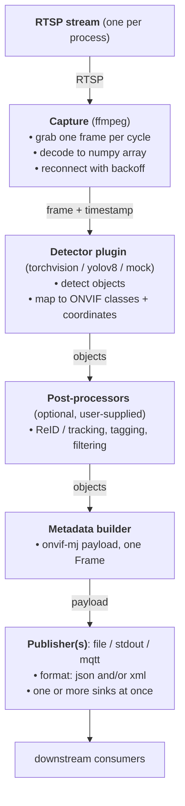

# Architecture

## Pipeline

One process handles one RTSP stream. Capture, detect, optionally post-process,
build the ONVIF payload, publish.



## Design

### Data model: ONVIF Profile M

The payload follows the Profile M model — `Frame` / `Object` / `Appearance` /
`Shape.BoundingBox` / `Class.ClassCandidate` — serialized as `onvif-mj` JSON
and/or `tt:MetadataStream` XML. The XML validates against the official ONVIF
`metadatastream.xsd` (`tests/test_compliance.py`). Coordinates use the ONVIF
normalized frame: `[-1, 1]`, origin center, y-up.

See [`docs/schema.md`](docs/schema.md) and `schema/onvif-mj.example.json`.

### Output: format and sink

Two independent axes, each multi-select (CLI or env):

- **format** — `json` and/or `xml`.
- **sink** — `file`, `stdout`, `mqtt`.

Every sink emits every selected format. Sinks run simultaneously — a payload can
be written to disk and published to MQTT at once (`MultiPublisher`).

The file sink writes atomic sidecars (`.tmp` then rename) under
`<output-root>/<name>/` as `<timestamp>.meta.json` / `.meta.xml`. The producer
does not write or modify image frames — only metadata.

Publisher contract:

```python
class Publisher(Protocol):
    def publish(self, payload: dict, frame_ref: FrameRef) -> None: ...
    def close(self) -> None: ...
```

### Detector plugin

```python
class Detector(Protocol):
    # frame: HxWxC uint8 RGB np.ndarray; returns objects already in ONVIF coords
    def detect(self, frame) -> list[DetectedObject]: ...
    @property
    def suppress_biometrics(self) -> bool: ...
```

Backends do the pixel→ONVIF mapping (`from_pixel_bbox`), so the rest of the
pipeline never sees pixel coordinates. Default: **torchvision** (BSD-3,
COCO-pretrained; CPU/MPS/CUDA). **YOLOv8** (Ultralytics, AGPL-3.0) is opt-in and
imported on demand. A `mock` backend drives tests.

### Biometric suppression — what it does and does not do

`suppress_biometrics` (default `True`) is a capability declared at the detector
boundary. When set, the detector loads no face/body submodels and emits no
`HumanFace`/`HumanBody` metadata. The guarantee is "do not compute the data,"
not "compute then strip."

It is **metadata-scope only**. It does **not** blur, mask, or alter the image.
This tool never writes or modifies the source frame at all; image redaction, if
needed, lives in a downstream consumer.

Example: surveying a field for non-people objects (vehicles, animals, equipment)
while guaranteeing that no biometric data is computed or cascaded to downstream
systems in the first place.

### Post-processor hook (extension point)

A post-processor runs after detection and before the metadata is built:

```python
class PostProcessor(Protocol):
    def process(self, objects: list[DetectedObject],
                frame: CapturedFrame) -> list[DetectedObject]: ...
```

Processors chain in order. This is where users add **ReID / tracking** (reassign
a stable `object_id`, which flows to ONVIF `@ObjectId`), histogram or attribute
tagging, face blurring, or filtering. None ship in core. Wire them from the
library (`run_camera(..., processors=[...])`), the CLI (`--processor
module:factory`), or a registered plugin name (below). See
[`examples/processors.py`](examples/processors.py).

Caveat: arbitrary descriptors (e.g. ReID embeddings) have no ONVIF metadata
field, so emitting those would require a schema extension.

### Plugins (entry points)

Publishers, detectors, and post-processors are discoverable via
`importlib.metadata` entry points (`onvif_m.plugins`). A separately-installed
package registers them under the `onvif_m.publishers` / `onvif_m.detectors` /
`onvif_m.processors` groups; the CLI then accepts the registered name in
`--sink` / `--detector` / `--processor`. Built-in names (file/stdout/mqtt,
torchvision/yolov8/mock) take precedence; plugins are additive. Each entry point
is a zero-arg factory returning the corresponding object, which self-configures
(e.g. from environment). For wiring that needs explicit construction, use the
library API instead.

### No tracking in core

Each frame is detected independently; `object_id` is a per-frame index, not
stable across frames. Cross-frame association is either a downstream consumer's
job or added via the post-processor hook above.

### Latency instrumentation (backlog)

Per-stage timestamps in the payload and a `profile` utility that reports
p50/p95/p99 from published sidecars are planned but not yet implemented (see
[`TODO.md`](TODO.md)). `onvif_m.bench` measures live detection latency today.

### Configuration

A single RTSP URL via CLI positional arg or `ONVIF_M_URL`; stream identity via
`--name` / `--profile-token` (each with an env equivalent); detector, format,
sink, and MQTT settings via flags or `ONVIF_M_*`. No config file, no roster.

### Single-stream, single-process

One process, one stream, parallel to nothing. State is limited to the output
directory. Scale by running one process per stream — sharding across streams or
hosts is the user's concern.

## What this architecture deliberately does NOT include

- **WS-Discovery / ONVIF Device, Media, Imaging services** — this is not a camera.
- **WS-Security authentication** — transport-layer auth (MQTT TLS, etc.) is a sink concern.
- **RTP metadata multiplexing** — no video pixels are co-streamed.
- **Multi-stream orchestration** — one stream per process; the user runs many.
- **Persistent state** — beyond the output directory, the producer is stateless.
